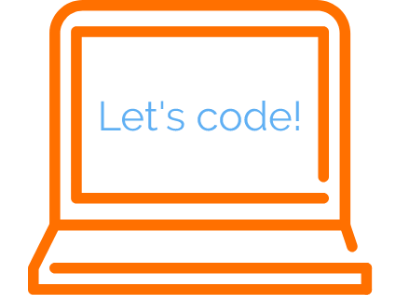

<style>
  footer:after {
    font-size: 12pt;
    content: attr(label);
    position: absolute;
    margin-left: auto;
    margin-right: auto;
    left: 0;
    right: 0;
    text-align:center;
    bottom: 20px;
    line-height: 1.9;
    display: block;
  }
</style>


```{r setup, include=FALSE}
knitr::opts_chunk$set(echo = FALSE)
knitr::opts_chunk$set(warning = FALSE)
knitr::opts_chunk$set(message = FALSE)
```

```{r libraries}
library("tidyverse")
library("maps")
library("tm")
library("SnowballC")
library("wordcloud")
library("RColorBrewer")
library("cowplot")
library("ggrepel")
```

```{r parse_data}
# Read data & parse it
google.csv <- read_csv("Rmarkdown_workshop.csv") %>%
  select(-1) %>%
  rename("rstudio" = "Do you use R/Rstudio regularly in your work or have you heard about these?",
         "rstudio.experience" = "What is your experience with R/Rstudio?",
         "rmarkdown" = "Do you use Rmarkdown regularly in your work or have you heard about Rmarkdown?",
         "why.rmarkdown" = "Why are you interested in learning Rmarkdown?",
         "learn.concept" = "What concepts most appeal to you? (try to chose one, or maximum two options)",
         "working.on" = "What are you currently working on (i.e., area of research)?",
         "country" = "Which country are you currently based?" ,
         "workshop.output" = "Finally, what are you expecting to get out of this workshop? (e.g., I want to be able to create reproducible reports of recurring analysis that I can present in an appealing way)") %>%
  mutate(rstudio.experience = sapply(strsplit(rstudio.experience, " "), "[", 1),
         country = ifelse(country == "The Netherlands",
                          yes = "Netherlands",
                          no = sapply(strsplit(country, " "), "[", 1)))
```

## A brief acknowledgement {data-background=#ffffff}
- First, I would like to acknowledge [Yan Holtz](https://www.yan-holtz.com) who introduced me to Rmarkdown. This workshop is largely based on his teachings, but also my own independent learning. 
- You might know him from [R graph gallery](https://www.r-graph-gallery.com)

## Rmarkdown workshop questionnaire | Where are you from? 

```{r participant_location, fig.align="center", fig.width= 8, fig.height=5}
# Get the world polygon
world <- map_data("world")%>% fortify

# Get coordinates
set.seed(42)
google.csv %>%
  group_by(country) %>%
  tally() %>%
  rename(region = country) %>%
  left_join(world) %>%
  group_by(region) %>%
  summarise(long = mean(long), lat = mean(lat), n = mean(n), group = mean(group)) %>%
# Plot world map
  ggplot() +
  geom_map(data = world, map = world,
                  aes(x = long, y = lat, group = group, map_id=region),
           fill = "gray", colour = "black", size=0.5) +
  geom_map(map = world, aes(x = long, y = lat, group = group, map_id=region,
                            fill = region)) +
  geom_label_repel(aes(x = ifelse(region == "USA",
                                  yes = long + 20, no = long),
                       y = ifelse(region == "USA", yes = lat - 10, no = lat), 
                       label = n, fill = region),
                   size = 3, hjust = 0.5, show.legend = F)+
  labs(fill = "Neurasmates location") + 
  theme_bw() + 
  theme(legend.position = "bottom", 
        legend.title = element_text(size = 14, face = "bold"),
        legend.text = element_text(size = 12))
```

## Rmarkdown workshop questionnaire | Do you know Rmarkdown? 

```{r questions1, fig.align="center", fig.width=10, fig.height=5}
# Stacked R/Rstudio
rstudio.cat.p <- google.csv %>%
  group_by(rstudio.experience) %>%
  tally() %>%
  ggplot(aes(x="",
             y = n,
             fill=rstudio.experience))+
  geom_bar(stat = "identity")+
  scale_fill_manual(values=c("#999999", "#E69F00", "#56B4E9")) +
  ggtitle("Beginners > Intermediates > Novice") + 
  ylab("Count") + 
  xlab("") + 
  labs(fill = "R/Rstudio\nexperience") + 
  theme_bw() + 
  ylim(c(0, 15)) +
  geom_label(aes(label = paste("N = " , n)),
             show.legend = F) + 
  theme(legend.position = "bottom", 
        legend.title = element_text(size = 12, face = "bold"),
        legend.text = element_text(size = 12),
        axis.ticks = element_blank())

# Stacked + percent
knows.rmark.p <- google.csv %>%
  group_by(rstudio.experience, rmarkdown) %>%
  tally() %>%
  group_by(rstudio.experience) %>%
  mutate(x = n / sum(n)) %>%
  ggplot() +
    geom_col(aes(
      x = factor(rstudio.experience),
      y = x * 100,
      fill = factor(rmarkdown)
      ), position = "stack") +
  ggtitle("Rmarkdown is more familiar to\nmore advanced users") + 
  ylab("Percentage (%)") + 
  xlab("R/Rstudio experience") + 
  scale_fill_viridis_d() + 
  labs(fill = "Have you heard of\nor used Rmarkdown?") + 
  theme_bw() + 
  theme(legend.position = "bottom", 
        legend.title = element_text(size = 12, face = "bold"),
        legend.text = element_text(size = 12))

plot_grid(rstudio.cat.p, NULL, knows.rmark.p, nrow = 1, rel_widths = c(0.475,0.05, 0.475))
```

## Rmarkdown workshop questionnaire | What concepts are you most interested in?

```{r questions2}
# Get concepts people are interested in
separate_rows(google.csv, learn.concept, sep = ";", convert = F) %>%
  count(learn.concept) %>%
  mutate(learn.concept = fct_reorder(learn.concept, n, .desc = FALSE)) %>%
    ggplot(aes(x = learn.concept, y = n)) + 
  geom_bar(stat = 'identity', fill = "darkred") + 
  coord_flip() + 
  ylab("Count") + 
  xlab("Concepts of interest") + 
  theme_bw() + 
  theme(panel.border = element_rect(colour = "black", fill=NA, size=2))
```

## Rmarkdown workshop questionnaire 
### Why are you interested in Rmarkdown? 
### What are you expecting from this workshop?

```{r wordcloud}
```

## Workshop outline

| Time          | Session                   | Activities summary                | 
| ------------- |---------------------------|:---------------------------------:|
| 12-1pm        | Introduction to Rstudio   | Getting familiar with Rstudio IDE |
| 1-1:30pm      | Lunch  break              | Friendly banter & lunch           |
| 1:30-2:30pm   | Introduction to Rmarkdown | Focus on tidyverse and data viz   |
  
    

<div style="text-align:center"></div>
